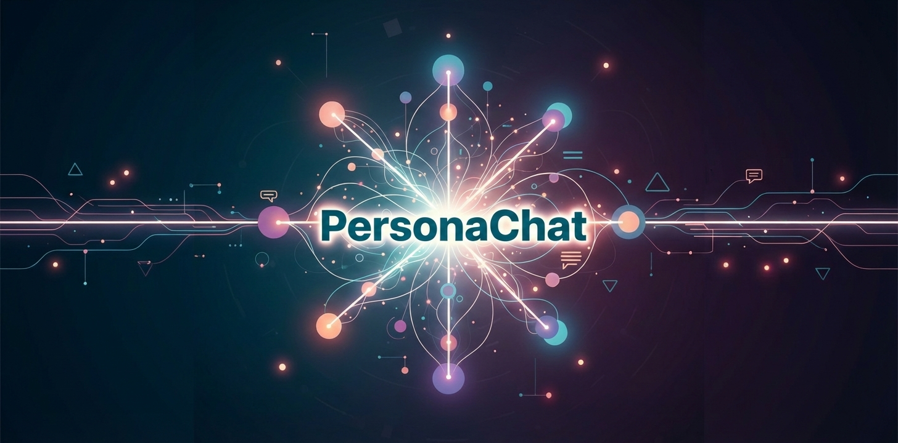

<div align="center">
  

  # Persona Chat
  ### The Neural UX Research Simulator

  > **"Static user personas are dead. Talk to the simulation."**

  [View Live Demo](https://ai.studio/apps/drive/1DA4gdc3jT25q3TgOjm2Qea7NQRlMw_Zr)
</div>

---

## 🔮 The Vibe Coding Project

**Persona Chat** represents a shift in how we build software. Developed using the **Vibe Coding methodology**, this project wasn't just written line-by-line; it was orchestrated through collaboration with AI.

* **The Architect:** Me (Design Logic & Vision)
* **The Engineer:** Google Gemini (Implementation & Syntax)
* **The Stack:** React + TypeScript + Gemini 3 Flash

---

## ✨ Key Features

<table>
  <tr>
    <td width="50%">
      <h3>🧠 Neural State Analysis</h3>
      <p>The AI doesn't just reply—it "feels." The system tracks emotional triggers (Frustrated, Excited, Bored) in real-time using custom sentiment logic.</p>
    </td>
    <td width="50%">
      <h3>📊 The VibePanel</h3>
      <p>A live dashboard plots the user's emotional journey on a dynamic vector graph, helping researchers pinpoint exactly where a conversation turned negative.</p>
    </td>
  </tr>
  <tr>
    <td width="50%">
      <h3>🎭 Custom Personas</h3>
      <p>Configure specific archetypes like "Impatient Executive" or "Confused Student" to test your designs against realistic behavioral patterns.</p>
    </td>
    <td width="50%">
      <h3>📄 Automated Insights</h3>
      <p>Generates a professional PDF research report with one click, including full chat transcripts and emotional data visualization.</p>
    </td>
  </tr>
</table>

---

## 💻 Tech Stack

<div align="center">
  
  
  
</div>

---

## 🛠️ Run Locally

**Prerequisites:** Node.js installed.

1.  **Clone the repository**
    ```bash
    git clone [YOUR_REPO_LINK_HERE]
    ```

2.  **Install dependencies**
    ```bash
    npm install
    ```

3.  **Set up your AI Key**
    Create a `.env.local` file and add your API key:
    ```env
    VITE_GEMINI_API_KEY=your_google_api_key_here
    ```

4.  **Start the simulation**
    ```bash
    npm run dev
    ```

---

<p align="center">
  <i>Developed for the Vibe Coding Course | WS 2025/26</i>
</p>
